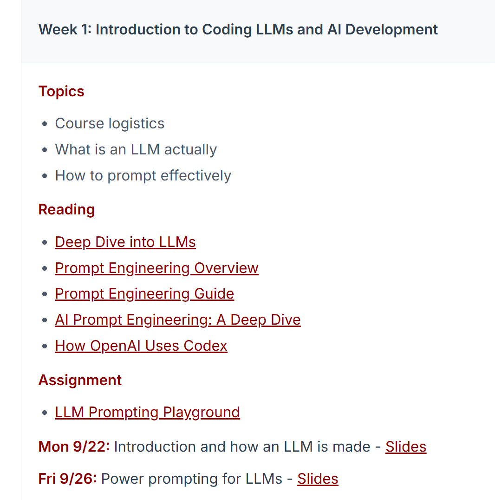
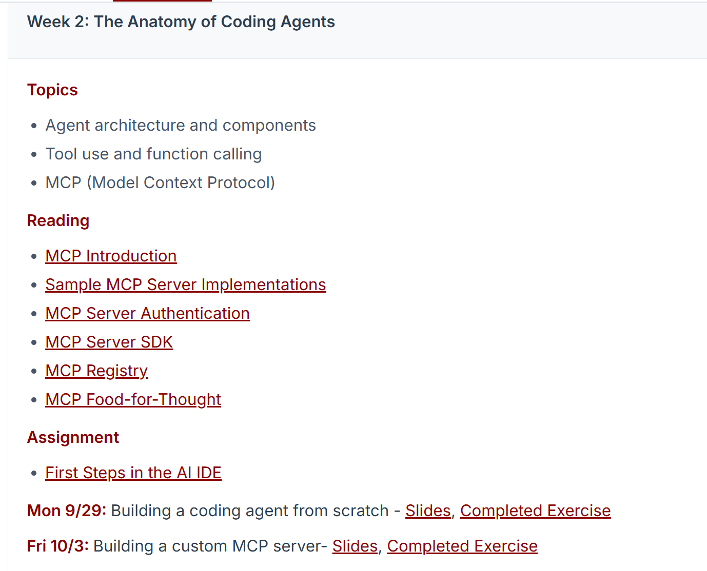
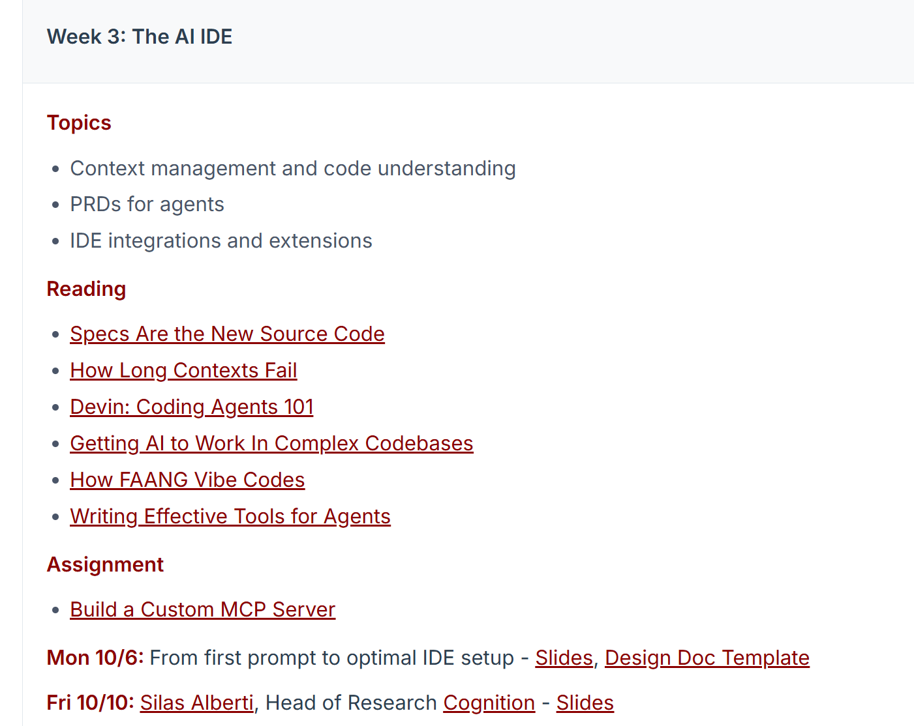
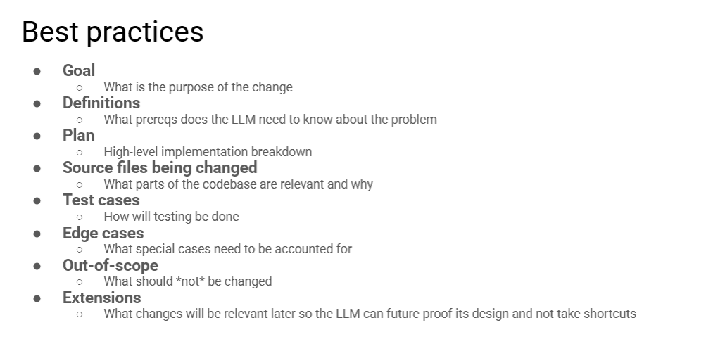

# CS146S: The Modern Software Developer

Stanford University • Fall 2025

今天发现一门斯坦福的对于传统软件工程向人工智能时代软件工程的转变的课，为一些比较基础的介绍和各类博客以及作业项目分享。

~~闲暇时间可以顺带过一下~~

第一周是主要关于Prompt Engineering 以及工具的使用介绍，链接第一个还放了大神安德烈卡帕西的面向大众的LLM课（超赞，以前专门看过)

---------

算是把MCP再系统性的复习了一下

---------

**完成了Week3的学习，并手动构建了一个MCP服务器**

**复杂任务先写详细规格文档（Spec）**：明确变更目的、前置依赖、实现拆分、修改文件、用例、边界场景、非改动范围，**规格文档成为 AI 时代新型源代码**

● 对于复杂的任务，需要扮演产品经理的角色

---------

