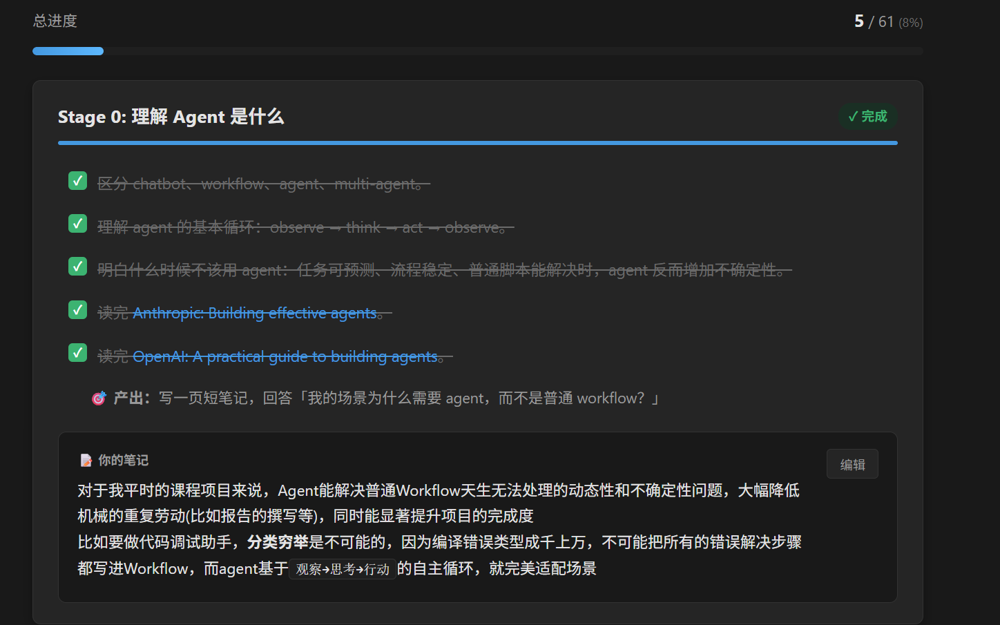
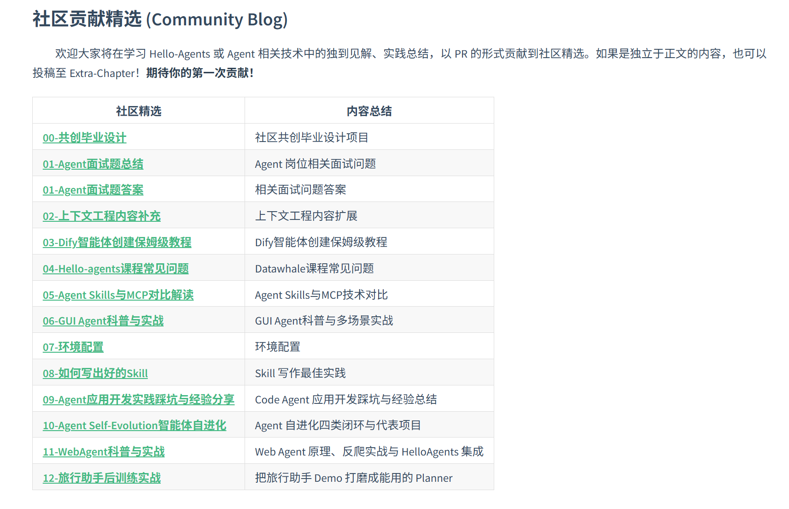
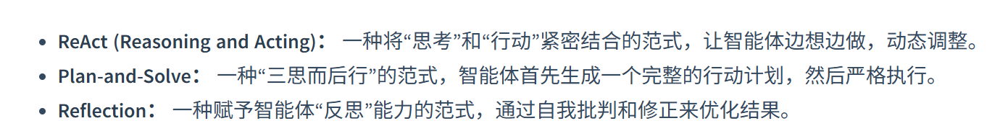

# Agent-Learning-Hub

**Stage1**：

Hello Agent：

~~**优秀资源** 待完成内容学习后进行学习~~

完成了Hello-Agent第一章，初识智能体的阅读

---------

完成了Hello-Agent第二章—智能体发展史（系统再了解到了智能体）

​				第三章—大语言模型基础（算是把学过的机器学习和深度学习串着再复习了一遍）

----

完成Hello-Agent 第四章—智能体经典范式构建的学习

系统性的通过编码回顾了这三种范式

---------

完成Hello-Agent 第五章—基于低代码平台的智能体搭建的学习

了解并实操了几个代表性的平台：Coze，Dify，FastGPT，n8n

---------

完成了Hello-Agent 第六章—框架开发实践

复习了LangGraph 以及了解到其他开发框架如：AutoGen、AgentScope、CAMEL

---------

完成了Hello-Agent 第七章—构建你的Agent框架

一步步构建了一个基础的智能体框架——HelloAgents。这个过程始终遵循着“分层解耦、职责单一、接口统一”的核心原则。

---------

完成了Hello-Agent 第八章—记忆与检索

为HelloAgents增加两个核心能力：**记忆系统（Memory System）**和**检索增强生成（Retrieval-Augmented Generation, RAG）**

---------

完成了Hello-Agent第九章—上下文工程

1. **ContextBuilder**：实现了 GSSC 流水线，提供统一的上下文管理接口
2. **NoteTool**：Markdown+YAML 的混合格式，支持结构化的长期记忆
3. **TerminalTool**：安全的命令行工具，支持即时的文件系统访问

级联效应：上游阶段的失效会被下游阶段放大。例如 Select 阶段混入大量无关信息，会导致 Compress 阶段无法精准识别核心内容，进一步加剧信息丢失或腐蚀。

---------

